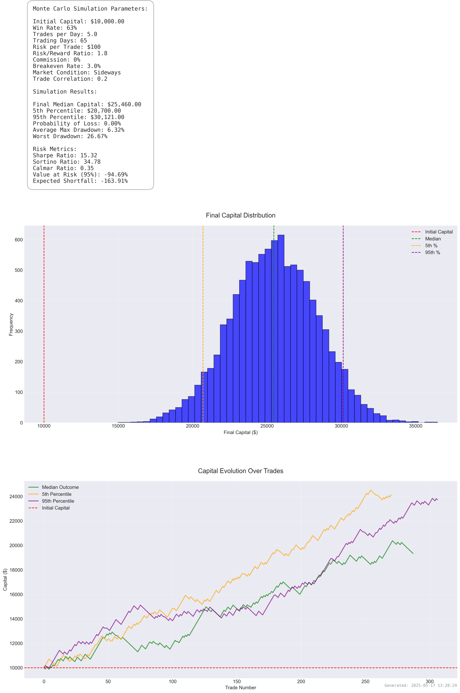

# Monte Carlo Trading Strategy Simulator

## Overview
This tool performs Monte Carlo simulations for trading strategies, helping traders understand potential outcomes and risks across thousands of simulated trading scenarios. It incorporates realistic trading conditions including breakeven trades, market conditions, and trade correlations.



## Features

### Core Functionality
- Multiple simulation scenarios (default: 10,000 runs)
- Configurable trading parameters
- Dynamic position sizing
- Market condition modeling
- Trade correlation effects
- Breakeven trade modeling
- Comprehensive risk metrics

### Risk Metrics
- Sharpe Ratio
- Sortino Ratio
- Calmar Ratio
- Value at Risk (VaR)
- Expected Shortfall
- Maximum Drawdown
- Win Rate Analysis

### Visualization
- Capital distribution histogram
- Trade-by-trade capital evolution
- Comprehensive parameter display
- High-resolution output (300 DPI)
- Professional styling

## Usage

### Basic Example
```python
from monte_carlo_sim import monte_carlo_simulation

results = monte_carlo_simulation(
    initial_capital=10000,    # Starting capital
    winrate=63,              # Win rate percentage
    trades_per_day=5.0,      # Average trades per day
    trading_days=65,         # Trading period
    risk_per_trade=100,      # Fixed dollar risk per trade
    is_risk_percent=False,   # Use fixed dollar amount
    risk_reward_ratio=1.8,   # Risk:Reward ratio
    commission=0,            # Commission percentage
    breakeven_rate=3.0       # Percentage of breakeven trades
)
```

### Parameters

#### Required Parameters
- `initial_capital` (float): Starting capital amount
- `winrate` (float): Win rate percentage (0-100)
- `trades_per_day` (float): Average number of trades per day
- `trading_days` (int): Number of trading days to simulate
- `risk_per_trade` (float): Risk per trade ($ or %)
- `risk_reward_ratio` (float): Risk:Reward ratio

#### Optional Parameters
- `is_risk_percent` (bool): True for percentage risk, False for fixed dollar (default: True)
- `commission` (float): Commission percentage per round trip (default: 0.01)
- `num_simulations` (int): Number of simulation runs (default: 10000)
- `correlation` (float): Trade correlation factor (default: 0.2)
- `volatility_factor` (float): Market volatility factor (default: 1.0)
- `market_condition` (str): Market condition ['bull', 'bear', 'sideways'] (default: 'sideways')
- `breakeven_rate` (float): Percentage of trades that move to breakeven (default: 3.0)

### Output
The simulation generates:
1. Statistical results dictionary containing:
   - Median final capital
   - 5th and 95th percentile outcomes
   - Probability of loss
   - Various risk metrics
2. High-resolution visualization plot saved to `plots_simulations/` directory

## Example Results
Using the default parameters (as shown in the image above), the simulation typically shows:
- Positive expected value with specified win rate and RR ratio
- Realistic drawdown patterns
- Trade correlation effects
- Impact of breakeven trades
- Clear risk/reward metrics

## Installation

1. Create a virtual environment:
```bash
python -m venv venv_monte_carlo
source venv_monte_carlo/bin/activate  # On Windows: venv_monte_carlo\Scripts\activate
```

2. Install required packages:
```bash
pip install numpy matplotlib pandas seaborn
```

## Dependencies
- Python 3.x
- NumPy
- Matplotlib
- Pandas
- Seaborn

## Notes
- The simulation uses a normal distribution to model daily trade frequency variation
- Trade outcomes can be correlated to model realistic market conditions
- Market conditions can affect win rates
- Position sizing can be fixed or percentage-based
- Breakeven trades are modeled separately from wins/losses

## Contributing
Feel free to submit issues and enhancement requests! 